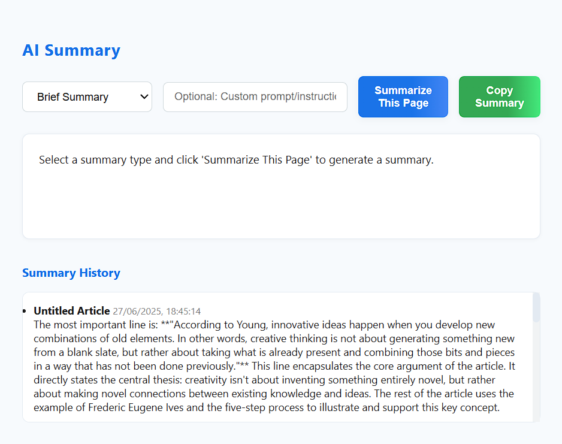

# AI Summariser Chrome Extension

Effortlessly summarize any web article using Google Gemini AI, right from your browser! This extension provides quick, high-quality summaries in various formats, lets you use custom instructions, and keeps a history of your recent summaries for easy reference.



## ✨ Features

- **One-Click Summarization:** Instantly summarize the current page with a single click.
- **Summary Types:** Choose from Brief, Detailed, or Bullet Point summaries.
- **Custom Prompt:** Enter your own instructions for the AI to tailor the summary.
- **Summary History:** View your last 5 summaries, each labeled with the article title.
- **Copy to Clipboard:** Easily copy summaries for use anywhere.
- **Modern UI:** Clean, responsive, and user-friendly popup design.
- **Secure:** Your API key is stored locally and never shared.

## 🚀 Getting Started

1. **Clone or Download** this repository.
2. **Get a Gemini API Key:**
   - Visit [Google AI Studio](https://makersuite.google.com/app/apikey) and generate your API key.
3. **Load the Extension in Chrome:**
   - Go to `chrome://extensions/`
   - Enable "Developer mode"
   - Click "Load unpacked" and select this project folder
4. **Set Your API Key:**
   - Click the extension icon
   - Go to "Settings" and paste your Gemini API key

## 🛠️ Usage

1. Navigate to any article or web page you want to summarize.
2. Click the AI Summariser extension icon.
3. Select your summary type, optionally enter a custom prompt, and click **Summarize This Page**.
4. View, copy, or review your summary history in the popup.

## ⚙️ Options

- **API Key Management:** Set or update your Gemini API key in the Settings page.
- **Custom Prompt:** Use the input field to instruct the AI (e.g., "Summarize for a 10-year-old").
- **History:** Access your last 5 summaries, each showing the article title and summary.

## 📦 Project Structure

```
ai-summariser-chrome-extension/
├── background.js
├── content.js
├── icon.png
├── image.png
├── manifest.json
├── options.html
├── options.js
├── popup.html
├── popup.js
├── popup.css
└── README.md
```

## 🧠 How It Works

- Extracts article text and title from the current page
- Sends the content to Gemini AI using your API key
- Displays the summary in the popup and saves it to history

## 📝 License

MIT License

---

> **Made with ❤️ for productivity and clarity.**
